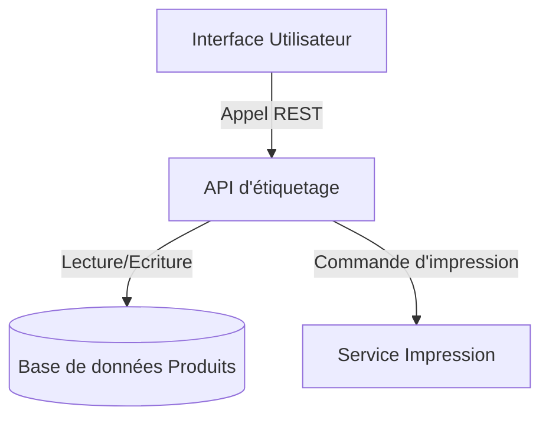

# Schéma d’architecture (exemple)

```mermaid
flowchart TD
    UI[Interface Utilisateur]
    API[API d'étiquetage]
    SVC[Service Impression]
    DB[(Base de données Produits)]
    UI -->|Appel REST| API
    API -->|Lecture/Ecriture| DB
    API -->|Commande d'impression| SVC
```
