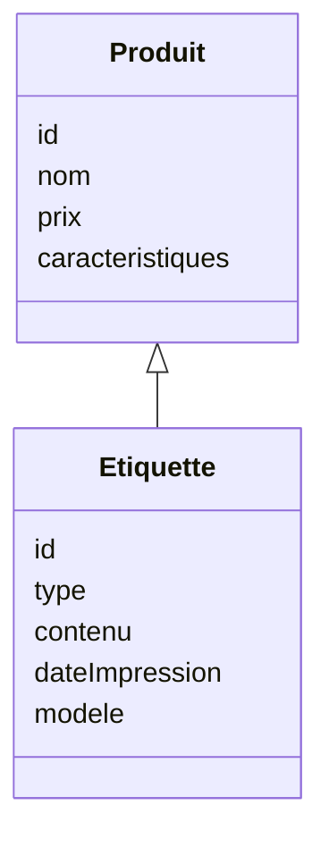

# Schéma des entités (exemple)

```mermaid
classDiagram
    Produit <|-- Etiquette
    Produit : id
    Produit : nom
    Produit : prix
    Produit : caracteristiques
    Etiquette : id
    Etiquette : type
    Etiquette : contenu
    Etiquette : dateImpression
    Etiquette : modele
```
